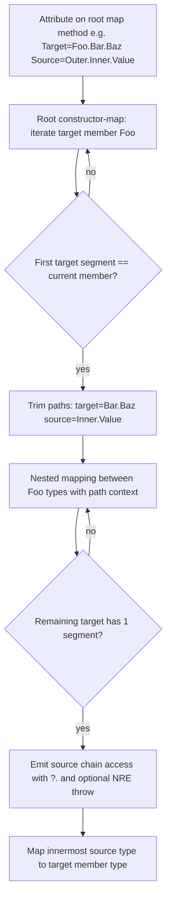

# The algorithm

The methods that can be auto-generated by _🗺️ Mappa_ need to satisfy the following:

- The class they belong to needs to be marked with the `[Mappa]` attribute;
- The class they belong to needs to be partial;
- The method needs to be partial;
- The method must return a non-`void` type;
- The method must not return a `Task<T>` (i.e. mapper methods cannot be `async`);
- The method must have one or two parameters; if the method has two parameters, the second must be of type `Mappa.MappaContext`;
- Methods marked with `[MappaIgnore]` are excluded from mapping resolution;
- Non-partial methods with an existing implementation can be registered as pre-mapped (used when resolving nested mappings);
- Methods from the mapper **base-class hierarchy** are collected automatically;
- Parameter ref modifiers must be absent or `in`; any other ref modifier causes the method to be rejected.

Once a method has been identified, assuming it has the following format:

```csharp
[Mappa]
public partial class Mapper
{
    public partial TTarget Map(TSource input);
}
```

the source generator attempts to identify a mapping from `TSource` to `TTarget`.

## Strategy resolution overview

Resolution follows one of two paths depending on whether the mapping is the **root** partial method or a **nested** type mapping (collection elements, dictionary keys/values, tuple items, constructor parameters, or property initializers).

### Root partial methods

Root partial methods use `TypeMapIdentifierAlgorithm`, which runs the **detector chain** described below. Root methods do not invoke an existing map method for themselves.

### Nested type mappings

Nested mappings use `TypeMapIdentifierWithMapMethodAlgorithm`, which runs an **existing-method pre-step** first (see below). If no existing method applies, the same detector chain is used.

### Existing-method pre-step (nested mappings only)

Before the detector chain, `TypeMapIdentifierWithMapMethodAlgorithm` checks whether a suitable map method already exists:

- _When_:
    - A method in the same class **or a base class of the mapper** from `TSource` to `TTarget` exists OR,
    - A method from a property or field marked with the `[MappaDependency]` **on the mapper or an accessible base class of the mapper**, or from a base class of the dependency type from `TSource` to `TTarget` exists OR,
    - A method from a type defined via the `[MappaStaticDependency]` attribute exists OR,
    - A polymorphic method where one of the `[MappaTypeMapping]` attributes matches `TSource` and `TTarget` OR,
    - Setting `PolymorphicMapMethodWithMatchingDefaultAttribute` is `Enable` and a polymorphic method with attribute `[MappaTypeMappingDefault]` and behaviour `MappaTypeMappingDefaultBehavior.MapSourceType`, where `TTarget` matches the target type defined by the attribute and `TSource` matches the source type of the method, exists;
- _What_:
    - The existing method is invoked;
- _Notes_:
    - A nested mapper method that requires `MappaContext` is only invoked when the caller provides context (the root map method has a `MappaContext` parameter);
    - This pre-step is used when mapping elements of an array, keys or values of dictionaries, elements of tuples, and properties or constructor parameters of class/struct/record types;
    - When `#nullable enable` is active, nullability annotations must match exactly first. If no exact match exists, the generator may reuse a method with a relaxed nullability signature on the same underlying types: nested mapping to `TTarget?` may invoke a method returning `TTarget`, and nested mapping from `TSource` may invoke a method accepting `TSource?`.

### Detector chain order

When no existing method applies (or for root methods), `TypeMapIdentifierAlgorithm` tries the following strategies **in order**:

1. Identity *(skipped when the root method has one or more `[MappaTypeMapping]` attributes)*
2. Nullable
3. Polymorphic *(only at the root, or immediately after nullable unwrapping — not at every nested level)*
4. Enum
5. String
6. Date & time
7a. IQueryable projection *(root methods with `IQueryable<TSource>` → `IQueryable<TTarget>` only)*
7. Container
8. Tuple
9. Guid
10. Constructor

## Strategy details

### 1. Identity strategy

- _When_:
    - `TSource` and `TTarget` are the same type (e.g. `TSource => int` and `TTarget => int`) OR,
    - `TSource` can be implicitly converted into `TTarget` (e.g. `TSource => int` and `TTarget => long`) OR,
    - `TSource` maps to `object` or `object?` (nullable-context rules apply: in `#nullable enable`, `T` maps to `object?`; in `#nullable disable`, `T` maps to `object`; when the source is not explicitly non-nullable annotated, `T` may map to non-nullable `object`);
- _What_:
    - By default (`ShallowCopy`), the input value is assigned to the target;
    - When `IdentityMapDeepCopy` is `DeepCopy` on a reference-type same-type root, the mapper clones the instance via `Mappa.MappaCloning.MemberwiseClone` (nested references remain shared);
    - When `IdentityMapDeepCopy` is `NestedDeepCopy` on a reference-type root, the mapper clones the instance and recursively maps every accessible instance field; on a struct root, the struct is copied and fields are mapped recursively (no `MemberwiseClone` on the struct itself);
    - Primitives, enums, and `string` same-type mappings always assign and ignore `IdentityMapDeepCopy`;
- _Notes_:
    - `DateTime` → `DateTimeOffset` is handled by the identity strategy (implicit conversion);
    - The identity detector is skipped when the root method has `[MappaTypeMapping]` attributes so that polymorphic mapping can run instead;
    - Same-type constructor-parameter identity in the constructor detector always uses shallow pass-through; `IdentityMapDeepCopy` applies only when the identity strategy is selected directly;
    - `NestedDeepCopy` on array or collection same-type roots falls through to the container strategy so elements are mapped;
    - Nested field resolution disables the identity detector to avoid infinite recursion.

### 2. Nullable strategy

- _When_:
    - `TSource` is the `Nullable<T>` value type (e.g. `int?`) OR,
    - `TSource` is a nullable reference type when `#nullable enable` (e.g. `string?`) OR,
    - `TSource` is a reference type when `#nullable disable` (e.g. `string` — treated as a nullable source, consistent with `IsReferenceNullable`) OR,
    - `TTarget` is a nullable value type and `TSource` is the corresponding non-nullable value type,
    - AND a mapping exists from source to target when nullability is stripped (or, for nullable target / non-nullable source, a mapping exists for the inner types);
- _What_:
    - When the source is nullable: if `TTarget` can be `null`, the mapper returns `null`; if `TTarget` cannot be `null`, the mapper throws a `NullReferenceException`;
    - When the target is nullable and the source is non-nullable: the inner type is mapped without a nullable wrapper;
- _Notes_:
    - After nullable unwrapping, the polymorphic detector may run if the root method has `[MappaTypeMapping]` attributes.

### 3. Polymorphic mapping

- _When_:
    - The root method has one or multiple `[MappaTypeMapping]` attributes, and the polymorphic detector is allowed to run (at the root, or immediately after the nullable detector);
- _What_:
    - The runtime type of the input determines how the mapping from `TSource` to `TTarget` happens;
    - For every `[MappaTypeMapping]` attribute a mapping is created;
    - The default mapping when the actual parameter type does not match any source type from the `[MappaTypeMapping]` attributes is determined by the `[MappaTypeMappingDefault]` attribute — if the attribute is not present, the default behaviour throws an exception;
- _Notes_:
    - The polymorphic detector does not run at every nested level; it runs only at the root or immediately after nullable unwrapping.

### 4. Enum strategy

- _When_:
    - `TSource` is an `enum` and `TTarget` is a different `enum`, an integral numeric type compatible with the enum, or a `string` OR,
    - `TSource` is an integral numeric type compatible with the enum and `TTarget` is an `enum` OR,
    - `TSource` is a `string` and `TTarget` is an `enum`;
- _What_:
    - **Enum → enum** and **enum → string**: a `switch` statement maps by shared enum member names, by shared underlying numeric values when `EnumToEnumMapSetting` is `NumericValue`, or by shared `[Description]` attribute values when `EnumStringMapSetting` or `EnumToEnumMapSetting` is `Description`;
    - When mapping **enum → enum**, if at least one source enum member cannot be paired with a target member (by name, numeric value, or Description, depending on `EnumToEnumMapSetting`), the generator reports warning **MP00039** and continues code generation; unmapped source values throw `ArgumentOutOfRangeException` at runtime;
    - When **Description** mapping is enabled, every enum member involved must have a non-empty `[Description]` attribute; otherwise the generator reports error **MP00040** and does not generate the mapping;
    - When **Description** mapping or case-insensitive member-name mapping would pair multiple source members with the same target member, the generator reports error **MP00041** and does not generate the mapping;
    - **Enum → integral**: maps enum members to their underlying integral values;
    - **Integral → enum**: maps integral values (cast to the enum underlying type) to enum members;
    - **String → enum**: maps string input to enum members by name or by `[Description]` value (handled by the enum strategy, not the string strategy, because the enum detector runs first); when `CaseInsensitiveEnumMap` is enabled in `MappaSettings`, member names or Description values are matched case-insensitively via `ToUpperInvariant()`;
    - **`[MappaMapEnumMember]`**, **`[MappaMapEnumIgnore]`**, and **`[MappaMapEnumDefault]`** on the map method are merged with settings-based pairing by `EnumMapConfigurationResolver`; explicit member overrides take precedence, ignored members are omitted, and unmapped values use the configured default arm (`Throw` or `UseDefaultValue`);
- _Notes_:
    - The enum detector runs before the general string strategy, so **`string` → `enum`** is handled here rather than by the string strategy;
    - **Enum → enum** matching uses member names by default; set `EnumToEnumMapSetting` to `NumericValue` to match by underlying numeric value, or to `Description` to match by `[Description]` attribute value;
    - **Enum ↔ string** matching uses member names by default; set `EnumStringMapSetting` to `Description` to match by `[Description]` attribute value;
    - **String → enum** and **enum → enum** member-name matching is case-sensitive by default; enable `CaseInsensitiveEnumMap` for case-insensitive member name or Description matching;
    - Warning **MP00039** is suppressed for members excluded via `[MappaMapEnumIgnore]` and when `[MappaMapEnumDefault]` is configured with `UseDefaultValue`;
    - Errors **MP00047**–**MP00054** halt mapping generation when enum configuration attribute validation fails (see [enum mapping configuration attributes](mappa-attributes.md#mappamapenummember-mappamapenumignore-and-mappamapenumdefault)).

### 5. String strategy

- _When_:
    - `TSource` is a `string` and `TTarget` is any of the numeric types OR,
    - `TSource` is a `string` and `TTarget` is any of the following types: `DateTime`, `DateTimeOffset`, `DateOnly`, `TimeOnly`, `TimeSpan`, `Guid`, `Uri` OR,
    - `TTarget` is a `string` OR,
    - `TSource` is a `string` and `TTarget` is any type with an accessible static `Parse(string)` method;
- _What_:
    - `TSource` is a `string` and `TTarget` is any of the numeric types: the relevant `Parse` method is invoked, possibly with the culture and [NumberStyles](https://learn.microsoft.com/en-us/dotnet/api/system.globalization.numberstyles) from `MappaSettings`;
    - When parsing numeric types from `string`, if a style is configured the generator emits the BCL overload that accepts `NumberStyles`: `Parse(input, style)` when culture is not configured, or `Parse(input, style, culture)` when culture is configured. The resolved style is the type-specific `NumberStyles` when set, otherwise `GlobalNumberStyle`. When neither is configured, the overload without `NumberStyles` is used;
    - `TSource` is a `string` and `TTarget` is `DateTime`, `DateTimeOffset`, `DateOnly`, `TimeOnly`, `TimeSpan`, or `Guid`: the relevant `Parse` or `ParseExact` method is used, possibly with format, culture, and [DateTimeStyles](https://learn.microsoft.com/en-us/dotnet/api/system.globalization.datetimestyles) from `MappaSettings`;
    - When parsing `DateTime`, `DateTimeOffset`, `DateOnly`, or `TimeOnly` from `string`, if a style is configured the generator emits the BCL overload that accepts `DateTimeStyles` as the last parameter: `Parse(input, culture, style)` or `ParseExact(input, format, culture, style)`. The resolved style is the type-specific `DateTimeStyles` when set, otherwise `GlobalDateTimeStyle`. When culture is not configured, `null` is passed for `IFormatProvider`. When neither type-specific nor global style is configured, the overload without `DateTimeStyles` is used;
    - When a `DateTimeStyles` or `NumberStyles` value from `[MappaSettings]` contains undefined bits (for example an arbitrary integer cast such as `(DateTimeStyles)999`), the generator reports warning **MP00038** and continues code generation using only the recognized flag bits in the emitted parse call. Values from `.editorconfig` that cannot be parsed are ignored without a diagnostic;
    - `TSource` is a `string` and `TTarget` is `Uri`: `System.UriBuilder` is used;
    - `TTarget` is a `string` and `TSource` is `DateTime`, `DateTimeOffset`, `DateOnly`, `TimeOnly`, `TimeSpan`, or `Guid`: the relevant `ToString()` overload is used, possibly with format and culture from `MappaSettings`;
    - `TTarget` is a `string` and `TSource` is any numeric type: the relevant `ToString` overload is used, possibly with format and culture from `MappaSettings`;
    - `TTarget` is a `string`: `TSource.ToString()` is used;
    - `TSource` is a `string` and `TTarget` has an accessible static `Parse(string)` method: the `Parse` method is invoked;
- _Notes_:
    - **`string` → `enum`** is handled by the **enum** strategy, not the string strategy;
    - When an accessible static `Parse(string)` exists, the string/`Parse` strategy runs **before** the constructor strategy; a single-`string`-parameter constructor does not take priority over static `Parse`.

### 6. Date & time strategy

- _When_:
    - `TSource` is a `DateTime` and `TTarget` is `long`, `DateOnly`, or `TimeOnly` OR,
    - `TSource` is a `DateTimeOffset` and `TTarget` is `long`, `DateOnly`, `TimeOnly`, or `DateTime` OR,
    - `TSource` is a `DateOnly` and `TTarget` is `long` or `DateTime` OR,
    - `TSource` is a `long` or any smaller numeric type implicitly castable to `long`, and `TTarget` is `DateTime` or `DateTimeOffset` OR,
    - `TSource` is a `TimeSpan` and `TTarget` is `double` OR,
    - `TSource` is a `double` and `TTarget` is `TimeSpan`;
- _What_:
    - The usual mapping conversions are used;
    - When mapping from `DateOnly` to `DateTime`, `TimeOnly.MinValue` is combined with `DateTimeKind.Utc`;
    - When mapping to or from `long`, Unix time is used;
    - When a timezone is required, UTC is implied;
- _Notes_:
    - `DateTime` → `DateTime` is handled by the **identity** strategy, not the date & time strategy;
    - `DateTime` → `DateTimeOffset` is handled by the **identity** strategy;
    - `DateTimeOffset` → `DateTime` is handled by the **date & time** strategy (not identity);
    - There is no dedicated `DateOnly` → `DateTimeOffset` strategy in the current implementation (only `DateOnly` → `DateTime`).

### 7a. IQueryable projection strategy

- _When_:
    - The root map method source type implements or is `IQueryable<TSource>`,
    - The root map method target type implements or is `IQueryable<TTarget>`,
    - `TSource` and `TTarget` are different types,
    - An element mapping from `TSource` to `TTarget` can be expressed as a projection-compatible expression (constructor/property mapping, identity, nullable, enums, and common primitive/date conversions),
    - The root method does not declare `MappaBeforeMap` / `MappaAfterMap` hooks or a `MappaContext` parameter;
- _What_:
    - The generator emits `return source.Select(element => /* projection expression */);`,
    - Element mapping is validated by `ProjectionCapabilityAnalyzer` and built by `ProjectionExpressionBuilder` (expression-tree-compatible code, not imperative statements),
    - A private companion element map method may also be generated for the `TSource` → `TTarget` pair;
- _Notes_:
    - Projection is **signature-driven**; no dedicated projection attribute is required,
    - Mapping attributes such as `[MappaUseProperty]` on the projection method participate in element construction,
    - Nested `IQueryable` properties, polymorphic root element maps, non-inlinable invoke methods, and before/after hooks are rejected with dedicated diagnostics (MP00055–MP00060),
    - Mapping `IQueryable<TSource>` to a concrete collection (for example `List<TTarget>`) is not a projection: the container path applies and may emit warning MP00061,
    - Prefer numeric or description enum mappings over case-insensitive member-name matching for ORM providers (warning MP00060),
    - Generated projection methods are annotated with `[RequiresDynamicCode]` and are **not compatible with Native AOT** deployment.

### 7. Container strategy

- _When_:
    - `TSource` and `TTarget` are both either dictionaries or collections,
    - For dictionaries, mappings exist from source key type to target key type and from source value type to target value type,
    - For collections, a mapping exists from the source element type to the target element type,
    - Neither side is an `IQueryable<T>` participating in a projection pair (queryable sources/targets are excluded from eager collection materialization when projection applies; see [§7a](#7a-iqueryable-projection-strategy)),
    - `TSource` dictionary types accepted:
        - any type implementing `IDictionary<TKey, TValue>`;
        - any type implementing `IReadOnlyDictionary<TKey, TValue>`;
        - any type implementing `IEnumerable<KeyValuePair<TKey, TValue>>`;
    - `TTarget` dictionary types accepted:
        - any type implementing `IDictionary<TKey, TValue>` that has a constructor with zero arguments;
        - the following interfaces: `IDictionary<TKey, TValue>`, `IReadOnlyDictionary<TKey, TValue>`, `IImmutableDictionary<TKey, TValue>`;
        - the following classes: `ImmutableDictionary<TKey, TValue>`, `ImmutableSortedDictionary<TKey, TValue>`, `FrozenDictionary<TKey, TValue>`, `ConcurrentDictionary<TKey, TValue>`;
    - `TSource` collection types accepted: any type implementing `IEnumerable<T>`, arrays, `Span<T>`, `ReadOnlySpan<T>`, `Memory<T>`, and `ReadOnlyMemory<T>`;
    - `TTarget` collection types accepted:
        - any type implementing `ICollection<T>` or `ISet<T>` that has a constructor with zero arguments (or one constructor with one integer argument of type `int` when `MappaSettings.ContainerCapacityConstructors` is enabled);
        - any type derived from `Stack<T>`, `Queue<T>`, or `BlockingCollection<T>` that has a constructor with zero arguments (or one constructor with one integer argument when `MappaSettings.ContainerCapacityConstructors` is enabled);
        - the following interfaces: `IEnumerable<T>`, `ICollection<T>`, `IReadOnlyCollection<T>`, `ISet<T>`, `IList<T>`, `IReadOnlyList<T>`, `IReadOnlySet<T>`, `IImmutableSet<T>`, `IImmutableList<T>`, `IImmutableQueue<T>`, `IImmutableStack<T>`, `IProducerConsumerCollection<T>`;
        - the following classes: arrays, `List<T>`, `ReadOnlyCollection<T>`, `Span<T>`, `ReadOnlySpan<T>`, `Memory<T>`, `ReadOnlyMemory<T>`, `Stack<T>`, `Queue<T>`, `ReadOnlySet<T>`, `HashSet<T>`, `SortedSet<T>`, `FrozenSet<T>`, `ImmutableHashSet<T>`, `ImmutableSortedSet<T>`, `ImmutableArray<T>`, `ImmutableList<T>`, `ImmutableQueue<T>`, `ImmutableStack<T>`, `ConcurrentBag<T>`, `ConcurrentQueue<T>`, `ConcurrentStack<T>`;
- _What_:
    - A `for` loop or `foreach` loop is added to the code;
    - In the loop, each element from the source collection is mapped to an element of the target collection and then added to the target collection;
- _Notes_:
    - When possible for some types (e.g. `List<T>`), the constructor accepting capacity is preferred to reduce allocations (`ContainerCapacityConstructors`);
    - When `MappaSettings.FastCollections` (or the corresponding `.editorconfig` setting) is enabled, collection mapping may use span-based iteration for array and `List<T>` sources and may allocate target arrays with a known capacity;
    - When `MappaSettings.EnumerableConcreteType` is `Array` (or the corresponding `.editorconfig` setting), sequence-like interface targets such as `IEnumerable<T>`, `IList<T>`, `ICollection<T>`, `IReadOnlyList<T>`, and `IReadOnlyCollection<T>` use a `T[]` buffer instead of `List<T>`; concrete `List<T>` targets are unchanged;
    - When `MappaSettings.DictionaryAssignment` is `Add` (or the corresponding `.editorconfig` setting), dictionary-to-dictionary mappings insert entries with `IDictionary<TKey, TValue>.Add(key, value)` instead of the indexer; explicit `IDictionary<K, V>` implementations use a typed interface temporary when required; the default is indexer assignment;
    - Explicit interface implementation is supported;
    - Types with an empty constructor are supported if they are derived from any of the supported interfaces or classes.

### 8. Tuple strategy

- _When_:
    - `TSource` and `TTarget` are both tuple types,
    - The number of elements in the tuple is the same,
    - For each element of the tuple there exists a mapping from source element to target element;
- _What_:
    - Each element of the source tuple is mapped into a new element of the target tuple;
    - The target tuple is created by combining the mapped elements;
- _Notes_:
    - Both named and unnamed tuples are supported;
    - The type `Tuple<T>` (and its variations with more elements) is supported.

### 9. Guid strategy

- _When_:
    - `TSource` is `Guid` and `TTarget` is `byte[]`, `Span<byte>`, `ReadOnlySpan<byte>`, `Memory<byte>`, or `ReadOnlyMemory<byte>`, OR
    - `TSource` is `byte[]`, `Span<byte>`, `ReadOnlySpan<byte>`, `Memory<byte>`, or `ReadOnlyMemory<byte>` and `TTarget` is `Guid`;
- _What_:
    - A mapping from `Guid` to `byte[]`/`Span<byte>` is defined using the relevant `Guid` constructors or the `Guid.ToByteArray()` method.

### 10. Constructor strategy

The constructor strategy has three sub-strategies, tried in order:

| Sub-strategy | When |
|--------------|------|
| **Mapping constructor** | An accessible constructor `TTarget(TSource input)` exists where the single parameter type matches the source type |
| **Empty constructor + property init** | An accessible zero-argument constructor exists; settable properties (and get-only collections per the notes below) can be mapped from the source |
| **Parameterized constructor** | No suitable empty-constructor path; the accessible constructor with the **most** mappable parameters is chosen (parameter names are matched to source properties case-insensitively by default) |

- _What_:
    - Each property, constructor argument, or mapping-constructor parameter is mapped and a new instance of `TTarget` is generated;
    - Get-only dictionary or collection properties for which a mapper exists are filled with mapped values from the corresponding source;
- _Notes_:
    - **Empty-constructor path**: property name matching is case-sensitive by default, configurable via `CaseInsensitivePropertyMap` and `IgnoreUnderscoreForPropertyMap` in `MappaSettings`;
    - **Parameterized-constructor path**: constructor parameter names are matched to source properties case-insensitively by default, with optional underscore-insensitive matching via `IgnoreUnderscoreForPropertyMap`;
    - Explicit interface implementation is supported for get-only dictionary and collection properties;
    - Get-only `Stack<T>`, `Queue<T>`, `ConcurrentStack<T>`, `ConcurrentQueue<T>`, `ConcurrentBag<T>`, and `BlockingCollection<T>` properties are filled post-construction using `Push`, `Enqueue`, or `Add` respectively;
    - The following attributes on the map **method** can override mapping behaviour (see [`Documentation/mappa-attributes.md`](mappa-attributes.md) for details):
        - `[MappaUseProperty]`
        - `[MappaIgnoreTargetProperty]` *(empty-constructor path only)*
        - `[MappaAssignFromContext]`
        - `[MappaAssignFromConstant]`
        - `[MappaInvokeMethod]` — optionally accepts `SourcePropertyName` to select the source property passed to the invoked method
        - `[MappaAssignToContext]` *(post-construction context writes; requires the caller to provide `MappaContext`)*
    - Those attributes accept flat names or [dot-separated nested property paths](#nested-property-paths);
    - When `MappaSettings.ProtobufOptional` is enabled, optional protobuf members are handled via companion `Has*` properties on the source and target types.

### Nested property paths

Mapping attributes that accept `TargetPropertyName` / `SourcePropertyName` may use dot-separated paths (for example `"Address.City"` ← `"Location.Address.City"`). See also [Mappa attributes — Nested property paths](mappa-attributes.md#nested-property-paths).



- A `PropertyPathContext` carries the remaining target and source segments while nested constructor mapping runs with attributes still enabled for path-filtered matching.
- Multi-segment target paths apply at the first segment; remaining segments are resolved on the nested type.
- When multiple nested attributes share the same outer target member (for example `[MappaUseProperty("Address.City", ...)]` with `[MappaIgnoreTargetProperty("Address.ZipCode")]`), mapping uses a nested attribute scope so sibling ignore/constant/context attributes apply correctly.
- At the leaf target member, remaining source segments are read from the **current nested source receiver** (reusing intermediate temps) as a chained access. Conditional access (`?.` vs `.`) is chosen from the **receiver** type at each step (`#nullable disable`: references and `Nullable<T>` use `?.`; `#nullable enable`: only annotated nullable references and `Nullable<T>`).
- `?? throw new System.NullReferenceException("...")` is appended only when the access expression can be null (any `?.` was used, or the leaf type is nullable-capable) **and** the target cannot be null. Non-nullable value-type leaves such as `int` never receive `?? throw`.
- `[MappaAssignToContext]` with a nested target path writes the leaf from the fully constructed result (for example `context[key] = result.Address.City`) after the parent object graph has been mapped.
- Invalid target paths report **MP00033**. A source path shorter than the target path reports **MP00043**. A missing source segment reports **MP00044**.

## Before and after map hooks

Root mapping methods may declare `[MappaBeforeMap]` and `[MappaAfterMap]` attributes on the mapper class and/or on the method. Hooks apply only to generated **root** methods; nested strategies do not resolve or emit them.

### Resolution

For each root method the generator collects class-scope then method-scope before attributes, and method-scope then class-scope after attributes, preserving Roslyn attribute declaration order within each scope. Each attribute is resolved to an accessible `void` method using the same location rules as `[MappaInvokeMethod]` (mapper-local, explicit static type, or field/property member type, including interface members). Accepted signature tiers, in order, are:

1. `ref T` + `MappaContext` (requires the map method to provide context)
2. `ref T`
3. `MappaContext` (requires the map method to provide context)
4. no parameters

`T` is the source type for before hooks and the target type for after hooks and must match exactly. An unresolved or invalid hook reports warning **MP00045** and is skipped. An ambiguous winning tier reports error **MP00042**. When class and method scope resolve to the same method for the same phase, warning **MP00046** is reported and the hook is kept once (class position for before map; method position for after map).

### Code generation

Generated root bodies wrap the core strategy as follows:

1. Invoke ordered before hooks (class then method). When the source parameter is `in` and a before hook requires `ref`, the generator copies the source into a mutable local first.
2. Execute the core mapping strategy.
3. When any after hooks exist, materialize the core result into a target local (including identity, nullable, collection, and polymorphic roots that would otherwise return an expression directly).
4. Invoke ordered after hooks (method then class) with `ref` target and optional context arguments as required.
5. Return the (possibly mutated) target.

When no after hooks are present, the existing return shape is preserved to avoid unrelated generated-code churn.

See also: [Mappa attributes — MappaBeforeMap and MappaAfterMap](mappa-attributes.md#mappabeforemap-and-mappaaftermap) and [MappaBeforeAfterMapHooksAttributeMapper.cs](../Mappa.Samples/MappaBeforeAfterMapHooksAttributeMapper.cs).

## Limitations

Currently unsupported features include:

- Generic type parameters on map methods (for example, `TTarget Map<TSource, TTarget>(TSource input)`).
- Nested `IQueryable` / collection projections inside member initializers (for example projecting `source.Children` as `IQueryable` inside a parent projection).
- Tuple and `Guid` expression builders inside queryable projections.
- Provider-specific expression shapes that compile but are not translated by a given LINQ provider at runtime.